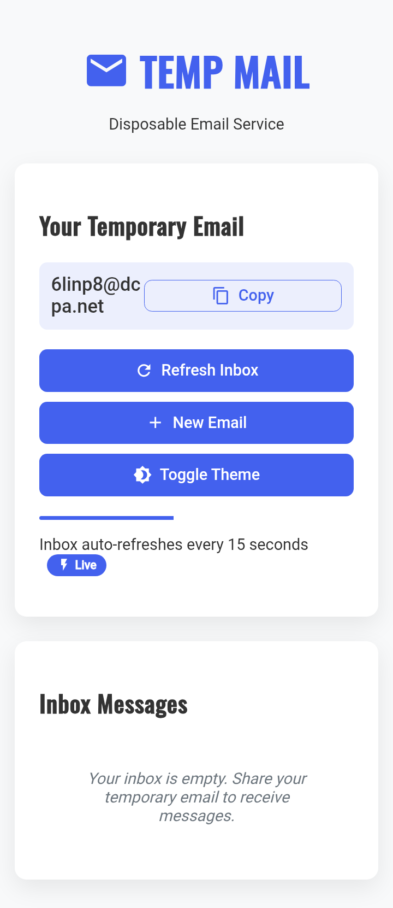
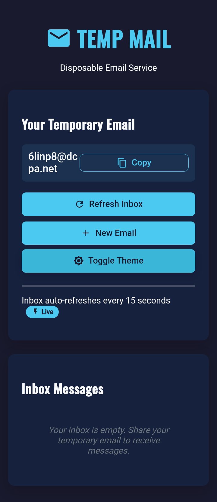

# 📧 Temp Mail - Mail.tm API Client

A lightweight, privacy-focused temporary email client built with the official [Mail.tm API](https://docs.mail.tm/). Generate disposable email addresses instantly and manage your inbox without compromising your real email.




## ✨ Features

**Core Functionality**
- 🚀 Instant disposable email generation
- 📬 Real-time inbox monitoring (auto-refresh every 15s)
- 🔍 View full email content (HTML/text support)
- 📋 One-click email copying

**Security & Privacy**
- 🔒 No tracking or analytics
- 🛡️ Session-based authentication
- 🗑️ Automatic account cleanup

**User Experience**
- 🌓 Dark/light mode toggle
- 📱 Fully responsive design
- 🔔 New email notifications (with sound alert)
- ⚡ Minimalist interface

## 🛠️ Technology Stack
- **Frontend**: Vanilla JavaScript (no frameworks)
- **API**: [Mail.tm REST API](https://docs.mail.tm/)
- **Styling**: Modern CSS (Flexbox/Grid)
- **Icons**: [Material Icons](https://fonts.google.com/icons)
- **Storage**: localStorage for session persistence

## 🚀 Quick Start

**Browser Usage**
1. Visit the [Live Demo](https://agaggsgsfsfwcau.github.io/tempmail/)
2. Start using immediately - no installation needed

**Local Development**
```bash
git clone https://github.com/yourusername/tempmail.git
cd tempmail
open index.html
```
## 🔧 How It Works

**1. On page load, the app:**

- Generates a random email address

- Creates a secure Mail.tm account

- Establishes an authenticated session

**2. Features:**

- Inbox auto-refreshes every 15 seconds

- Click any message to view full content

- Copy your temp email with one click

- Toggle between dark/light themes

## 🌟 Why Choose This Client?

100% client-side (no server needed)

Open source alternative to commercial webmail sites

Perfect for:

- Service testing

- Temporary signups

- Privacy protection

- Development workflows

## 📜 License
MIT Licensed - Free for personal and commercial use
